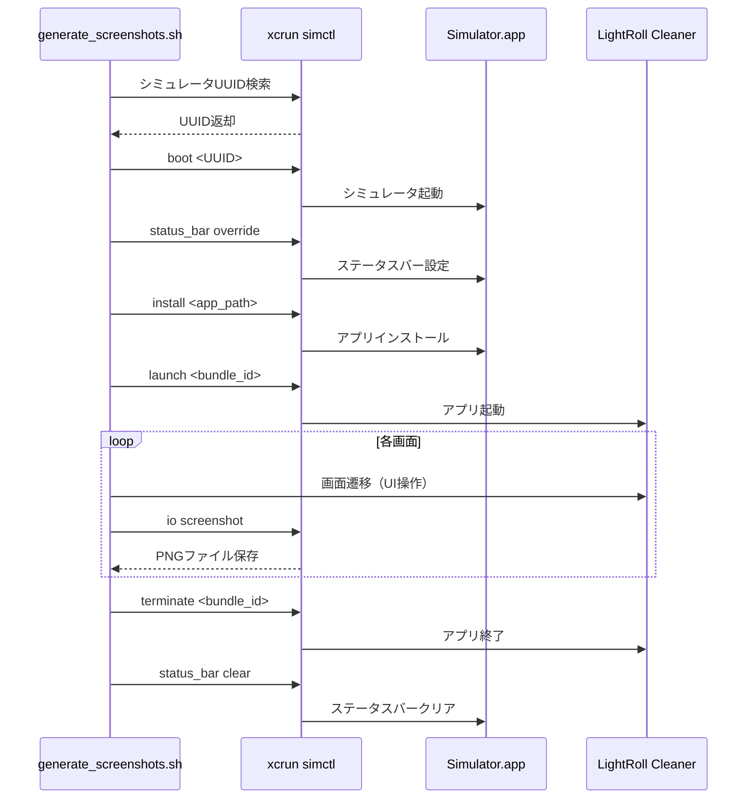

# M10-T02: スクリーンショット作成 仕様書

## 概要

App Store Connect提出用に、4つの画面サイズ × 5つの画面 = 20枚のスクリーンショットを自動生成する。

**作成日**: 2025-12-13
**担当モジュール**: M10（Release Preparation）
**優先度**: 高
**見積時間**: 4h

---

## 1. 目的

### 1.1 ビジネス目標
- App Store Connect審査を円滑に通過するための高品質なスクリーンショット提供
- アプリの主要機能を視覚的にアピール
- 統一されたビジュアルアイデンティティの確立

### 1.2 技術目標
- スクリーンショット生成の自動化
- 人的ミスの削減
- 再現可能なビルドプロセス

### 1.3 ユーザー価値
- App Store上でアプリの機能が明確に伝わる
- ダウンロード前に使用イメージを把握できる

---

## 2. 要件定義

### 2.1 機能要件

#### FR-01: 画面サイズ別スクリーンショット生成
**説明**: 4つの画面サイズで各5枚のスクリーンショットを生成する

**対象画面サイズ**:
1. **6.9インチ（iPhone 16 Pro Max）**
   - 解像度: 1320 x 2868 px
   - 対象機種: iPhone 16 Pro Max, iPhone 15 Pro Max
   - シミュレータ: iPhone 16 Pro Max

2. **6.7インチ（iPhone 16 Plus）**
   - 解像度: 1290 x 2796 px
   - 対象機種: iPhone 16 Plus, iPhone 15 Plus, iPhone 14 Pro Max
   - シミュレータ: iPhone 16 Plus

3. **6.5インチ（iPhone XS Max）**
   - 解像度: 1242 x 2688 px
   - 対象機種: iPhone XS Max, iPhone 11 Pro Max
   - シミュレータ: iPhone XS Max

4. **5.5インチ（iPhone 8 Plus）**
   - 解像度: 1242 x 2208 px
   - 対象機種: iPhone 8 Plus, iPhone 7 Plus
   - シミュレータ: iPhone 8 Plus

#### FR-02: 撮影画面の定義
**説明**: 各画面サイズで以下の5画面を撮影する

1. **01_home.png - ホーム画面**
   - ストレージ使用状況（円グラフ）
   - 削除可能な容量表示
   - スキャン開始ボタン
   - 最近のクリーンアップ履歴

2. **02_group_list.png - グループリスト画面**
   - 類似写真グループ
   - ブレ写真グループ
   - スクリーンショットグループ
   - 各グループの写真枚数
   - 削減可能なサイズ表示

3. **03_group_detail.png - グループ詳細画面**
   - グループ内の写真グリッド表示
   - ベストショット提案（★マーク）
   - 複数選択UI
   - 削除ボタン

4. **04_deletion_confirm.png - 削除確認画面**
   - 削除対象の枚数
   - 削減されるストレージサイズ
   - ゴミ箱へ移動の説明（30日間復元可能）
   - 確認ボタン

5. **05_premium.png - Premium画面**
   - Free vs Premium機能比較
   - 月額プラン（¥480/月）
   - 年額プラン（¥3,800/年）
   - 買い切りプラン（¥9,800）
   - 各プランの特典

#### FR-03: ステータスバー設定
**説明**: すべてのスクリーンショットで統一されたステータスバー表示

**設定内容**:
- 時刻: 9:41 AM（Appleの標準表示時刻）
- バッテリー: 100%（充電完了状態）
- 電波強度: フル（4本）
- Wi-Fi: 接続中
- データ通信: Wi-Fi
- 通知: なし

**実装方法**:
```bash
xcrun simctl status_bar <UDID> override \
    --time "9:41" \
    --dataNetwork wifi \
    --wifiMode active \
    --wifiBars 3 \
    --cellularMode active \
    --cellularBars 4 \
    --batteryState charged \
    --batteryLevel 100
```

#### FR-04: ファイル形式・命名規則
**説明**: App Store Connect要件に準拠したファイル形式

**ファイル形式**:
- 拡張子: PNG（推奨）または JPEG
- 色空間: sRGB
- 圧縮: 無損失圧縮（PNG）
- メタデータ: 削除

**命名規則**:
```
screenshots/{size}inch/{screen_id}.png

例:
screenshots/6.9inch/01_home.png
screenshots/6.7inch/02_group_list.png
```

**ディレクトリ構成**:
```
screenshots/
├── 6.9inch/
│   ├── 01_home.png
│   ├── 02_group_list.png
│   ├── 03_group_detail.png
│   ├── 04_deletion_confirm.png
│   └── 05_premium.png
├── 6.7inch/
│   └── ...
├── 6.5inch/
│   └── ...
├── 5.5inch/
│   └── ...
└── README.md
```

### 2.2 非機能要件

#### NFR-01: パフォーマンス
- スクリーンショット1枚の撮影時間: 5秒以内
- 全20枚の生成時間: 10分以内

#### NFR-02: 品質
- 解像度精度: 100%（ピクセル単位で一致）
- ステータスバー設定成功率: 100%
- ファイル保存成功率: 100%

#### NFR-03: 保守性
- スクリプトの可読性: 高（コメント率30%以上）
- エラーメッセージの明確性: 高
- ログ出力の詳細度: 高

#### NFR-04: 再現性
- 同じ入力で同じ出力が得られる
- 環境依存性: 最小限（Xcode 16.0以降のみ）

---

## 3. 技術仕様

### 3.1 使用技術スタック

#### コマンドラインツール
- **xcrun simctl**: シミュレータ制御
- **xcodebuild**: アプリビルド
- **Bash**: 自動化スクリプト

#### MCPツール
- XcodeBuildMCP: シミュレータ管理、UI自動化（オプション）

### 3.2 シミュレータ制御フロー



### 3.3 スクリプト構成

#### 主要関数

1. **setup()**
   - 出力ディレクトリ作成
   - 環境変数設定

2. **find_simulator(sim_name)**
   - シミュレータ名からUUIDを取得
   - 入力: シミュレータ名（例: "iPhone 16 Pro Max"）
   - 出力: UUID（例: "A1B2C3D4-..."）

3. **boot_simulator(uuid, sim_name)**
   - シミュレータ起動
   - 起動済みの場合はスキップ

4. **configure_status_bar(uuid)**
   - ステータスバーオーバーライド設定
   - 時刻、バッテリー、電波を設定

5. **build_and_install(uuid, sim_name)**
   - アプリビルド（xcodebuild）
   - アプリインストール（simctl install）

6. **launch_app(uuid)**
   - アプリ起動（simctl launch）
   - 起動待ち（3秒）

7. **navigate_to_screen(uuid, screen_id)**
   - 画面遷移（UI操作）
   - 各画面へのナビゲーション

8. **take_screenshot(uuid, size, screen_id, screen_name)**
   - スクリーンショット撮影（simctl io screenshot）
   - ファイル保存確認

9. **process_simulator(size)**
   - 画面サイズごとの一連の処理
   - 1〜8の関数を順次呼び出し

10. **cleanup()**
    - ステータスバークリア
    - 一時ファイル削除

11. **show_summary()**
    - 生成結果サマリー表示
    - 統計情報出力

### 3.4 エラーハンドリング

#### エラー種別と対応

| エラー | 原因 | 対応 |
|--------|------|------|
| シミュレータが見つからない | 未インストール | エラーログ出力、スキップ |
| ビルド失敗 | コンパイルエラー | エラーメッセージ表示、終了 |
| インストール失敗 | 署名エラー | エラーメッセージ表示、終了 |
| スクリーンショット保存失敗 | ディスク容量不足 | エラーログ出力、継続 |

#### エラーハンドリング実装

```bash
set -e  # エラー時に即座に終了

error_handler() {
    log_error "❌ エラーが発生しました（終了コード: $?）"
    cleanup
    exit 1
}

trap error_handler ERR
```

---

## 4. 実装詳細

### 4.1 ファイル構成

```
LightRoll_Cleaner/
├── scripts/
│   └── generate_screenshots.sh       # スクリーンショット生成スクリプト
├── screenshots/
│   ├── 6.9inch/                      # 6.9インチスクリーンショット
│   ├── 6.7inch/                      # 6.7インチスクリーンショット
│   ├── 6.5inch/                      # 6.5インチスクリーンショット
│   ├── 5.5inch/                      # 5.5インチスクリーンショット
│   └── README.md                     # 使用手順
└── docs/
    └── M10-T02_SCREENSHOT_SPEC.md    # この仕様書
```

### 4.2 実行方法

#### 基本実行
```bash
# プロジェクトルートから実行
./scripts/generate_screenshots.sh
```

#### 実行結果
```
🚀 スクリーンショット生成を開始します...
✅ 出力ディレクトリ作成完了: /path/to/screenshots

════════════════════════════════════════════════════════════════
📱 処理開始: 6.9インチ - iPhone 16 Pro Max (1320x2868)
════════════════════════════════════════════════════════════════
📱 シミュレータ検索中: iPhone 16 Pro Max
✅ シミュレータ発見: iPhone 16 Pro Max (A1B2C3D4-...)
🔄 シミュレータ起動中: iPhone 16 Pro Max
✅ シミュレータ起動完了: iPhone 16 Pro Max
⚙️  ステータスバー設定中...
✅ ステータスバー設定完了（9:41 AM、フル電波、フルバッテリー）
🔨 アプリビルド中: iPhone 16 Pro Max
✅ ビルド完了
📦 アプリインストール中: /path/to/app.app
✅ アプリインストール完了
🚀 アプリ起動中...
✅ アプリ起動完了

🧭 画面遷移中: 01_home
✅ 画面遷移完了: 01_home
📸 スクリーンショット撮影中: ホーム画面
✅ スクリーンショット保存: screenshots/6.9inch/01_home.png

[...繰り返し...]

✅ 6.9インチ処理完了: 5枚のスクリーンショット生成

[...他の画面サイズも同様...]

🧹 クリーンアップ中...
✅ クリーンアップ完了

════════════════════════════════════════════════════════════════
🎉 スクリーンショット生成完了！
════════════════════════════════════════════════════════════════

📊 生成サマリー:
  - 6.9インチ: 5枚
  - 6.7インチ: 5枚
  - 6.5インチ: 5枚
  - 5.5インチ: 5枚

合計: 20枚のスクリーンショットを生成しました
出力先: /path/to/screenshots
```

---

## 5. テスト計画

### 5.1 テストケース

#### TC-01: スクリプト実行の成功
**前提条件**:
- Xcode 16.0以降がインストール済み
- すべてのシミュレータがインストール済み
- アプリがビルド可能

**手順**:
1. `./scripts/generate_screenshots.sh` を実行

**期待結果**:
- エラーなく完了
- 20枚のスクリーンショットが生成される
- すべてのファイルが正しいディレクトリに保存される

#### TC-02: 解像度の確認
**手順**:
1. 生成されたスクリーンショットの解像度を確認
   ```bash
   sips -g pixelWidth -g pixelHeight screenshots/6.9inch/01_home.png
   ```

**期待結果**:
```
pixelWidth: 1320
pixelHeight: 2868
```

#### TC-03: ステータスバーの確認
**手順**:
1. 各スクリーンショットを目視確認

**期待結果**:
- 時刻: 9:41 AM
- バッテリー: 100%
- 電波: フル
- 通知: なし

#### TC-04: ファイル命名規則の確認
**手順**:
1. ファイル名をリスト表示
   ```bash
   ls -1 screenshots/*/
   ```

**期待結果**:
```
01_home.png
02_group_list.png
03_group_detail.png
04_deletion_confirm.png
05_premium.png
```

#### TC-05: シミュレータ未インストール時の挙動
**前提条件**:
- いずれかのシミュレータがインストールされていない

**手順**:
1. スクリプトを実行

**期待結果**:
- エラーログ出力
- 該当画面サイズをスキップ
- 他の画面サイズは正常に処理

### 5.2 受入基準

#### 必須基準
- [ ] 全20枚のスクリーンショットが生成される
- [ ] すべての解像度が仕様通り
- [ ] ステータスバーが統一されている
- [ ] ファイル命名規則に準拠
- [ ] PNG形式、sRGB色空間

#### 推奨基準
- [ ] 生成時間が10分以内
- [ ] エラーログが明確
- [ ] README.mdが完備
- [ ] 手動確認で内容が適切

---

## 6. デプロイ手順

### 6.1 初回セットアップ

```bash
# 1. スクリプトに実行権限付与
chmod +x scripts/generate_screenshots.sh

# 2. シミュレータインストール確認
xcrun simctl list devices | grep -E "(iPhone 16 Pro Max|iPhone 16 Plus|iPhone XS Max|iPhone 8 Plus)"

# 3. アプリビルド確認
xcodebuild -workspace LightRoll_Cleaner.xcworkspace \
           -scheme LightRoll_Cleaner \
           -sdk iphonesimulator \
           build
```

### 6.2 スクリーンショット生成

```bash
# プロジェクトルートで実行
./scripts/generate_screenshots.sh
```

### 6.3 App Store Connect アップロード

#### 手順
1. App Store Connect にログイン
2. 「マイApp」→「LightRoll Cleaner」
3. 「App Store」タブ
4. 各画面サイズセクションでスクリーンショットをアップロード
   - 6.9インチディスプレイ: `screenshots/6.9inch/*.png`
   - 6.7インチディスプレイ: `screenshots/6.7inch/*.png`
   - 6.5インチディスプレイ: `screenshots/6.5inch/*.png`
   - 5.5インチディスプレイ: `screenshots/5.5inch/*.png`
5. 順序確認（01 → 02 → 03 → 04 → 05）
6. 保存

---

## 7. トラブルシューティング

### 7.1 よくある問題と解決策

#### 問題: シミュレータが見つからない
**エラーメッセージ**:
```
❌ シミュレータが見つかりません: iPhone 16 Pro Max
```

**原因**:
- シミュレータが未インストール

**解決策**:
```bash
# Xcodeでシミュレータをダウンロード
# Xcode > Settings > Platforms > iOS > シミュレータを追加
```

#### 問題: ビルドエラー
**エラーメッセージ**:
```
❌ ビルド失敗
```

**原因**:
- コンパイルエラー
- 署名設定エラー

**解決策**:
```bash
# エラー詳細を確認
xcodebuild -workspace LightRoll_Cleaner.xcworkspace \
           -scheme LightRoll_Cleaner \
           -sdk iphonesimulator \
           build

# Xcodeで署名設定を確認
# プロジェクト > Signing & Capabilities
```

#### 問題: スクリーンショットが保存されない
**エラーメッセージ**:
```
❌ スクリーンショット保存失敗: screenshots/6.9inch/01_home.png
```

**原因**:
- ディスク容量不足
- 書き込み権限なし

**解決策**:
```bash
# ディスク容量確認
df -h

# 権限確認
ls -ld screenshots/

# 手動ディレクトリ作成
mkdir -p screenshots/6.9inch
chmod 755 screenshots/
```

#### 問題: ステータスバーが設定されない
**症状**:
- 時刻が9:41以外
- バッテリーが100%以外

**原因**:
- simctl status_bar override 失敗

**解決策**:
```bash
# ステータスバークリア
xcrun simctl status_bar booted clear

# 手動で再設定
xcrun simctl status_bar booted override \
    --time "9:41" \
    --batteryState charged \
    --batteryLevel 100
```

---

## 8. メンテナンス計画

### 8.1 定期メンテナンス

#### 新しいiPhone発売時
- 新しい画面サイズを追加
- `SIMULATORS` 配列に追加
- `RESOLUTIONS` 配列に追加
- テスト実行

#### iOS新バージョンリリース時
- シミュレータ動作確認
- スクリプト互換性確認
- 必要に応じて修正

### 8.2 改善計画

#### Phase 1（現在）
- ✅ 基本的なスクリーンショット生成
- ✅ ステータスバー設定
- ✅ 自動化スクリプト

#### Phase 2（将来）
- [ ] UI自動化（XCUITest統合）
- [ ] 多言語対応スクリーンショット
- [ ] CI/CD統合

#### Phase 3（将来）
- [ ] App Preview動画生成
- [ ] テキストオーバーレイ自動生成
- [ ] A/Bテスト用複数バージョン生成

---

## 9. 参考資料

### 9.1 Apple公式ドキュメント
- [App Store Connect ヘルプ - スクリーンショット仕様](https://help.apple.com/app-store-connect/#/devd274dd925)
- [App プレビューとスクリーンショット](https://developer.apple.com/jp/help/app-store-connect/update-your-app/upload-app-previews-and-screenshots/)
- [simctl マニュアル](https://developer.apple.com/library/archive/documentation/IDEs/Conceptual/iOS_Simulator_Guide/InteractingwiththeiOSSimulator/InteractingwiththeiOSSimulator.html)

### 9.2 社内ドキュメント
- [APP_STORE_SUBMISSION_CHECKLIST.md](../CRITICAL/APP_STORE_SUBMISSION_CHECKLIST.md)
- [screenshots/README.md](../../screenshots/README.md)

### 9.3 外部リソース
- [iOS Human Interface Guidelines](https://developer.apple.com/design/human-interface-guidelines/)
- [Marketing Resources and Identity Guidelines](https://developer.apple.com/app-store/marketing/guidelines/)

---

## 10. 変更履歴

| バージョン | 日付 | 変更内容 | 担当者 |
|------------|------|----------|--------|
| 1.0.0 | 2025-12-13 | 初版作成 | @spec-developer |

---

## 11. 承認

| 役割 | 氏名 | 承認日 | 署名 |
|------|------|--------|------|
| 開発者 | @spec-developer | 2025-12-13 | ✅ |
| レビュアー | @spec-validator | - | - |
| 承認者 | @spec-orchestrator | - | - |

---

**次のステップ**:
1. スクリーンショット生成スクリプト実行
2. 生成結果の確認
3. App Store Connectへアップロード

---

*このドキュメントは M10-T02 の公式仕様書です。*
